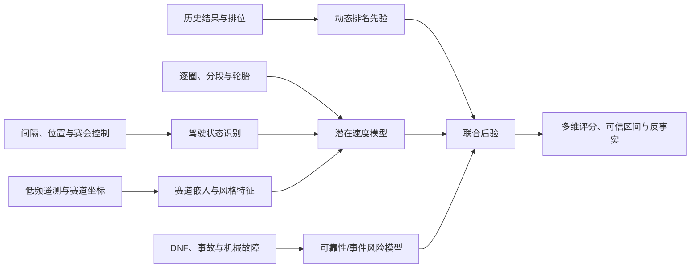

# 基于公开数据分离 F1 车辆性能与车手能力的科研建模报告

**版本：** 0.1 研究方案稿
**日期：** 2026-07-16
**项目：** F1 TR
**研究性质：** 基于非官方公开数据的可复现统计研究，不代表 FIA、FOM、车队或轮胎供应商的工程结论

## 摘要

本报告研究如何使用公开的比赛结果、逐圈计时、轮胎、天气、赛会控制、间隔、位置和低频车辆遥测，尽可能分离 F1 车辆性能、车手能力、车手—车辆适配、策略与随机事件的贡献。核心困难并非算法复杂度不足，而是**可识别性**：车手与车辆总是共同出现，燃油、设定、升级、损伤、动力模式和真实轮胎状态又不可见；如果直接用积分、完赛名次或原始圈速训练模型，模型极易把车队资源、赛道位置和策略选择误记为车手能力。

本报告建议采用分层研究体系，而不是一次性生成单一排行榜：

1. 用动态贝叶斯 Rank-Ordered Logit / Plackett–Luce 模型建立历史时期的车手—车队低频先验；
2. 用**动态贝叶斯多视图切换状态空间模型**作为 2023 年以后的主模型，在逐圈或分段层面估计标准化条件下的潜在速度；
3. 用隐马尔可夫或半马尔可夫状态区分 push、manage、traffic、Safety Car、pit、incident 等不可直接观测的驾驶意图；
4. 用联合生存模型保留 DNF、机械故障和事故，避免“删除未完赛车手”产生幸存者偏差；
5. 用赛道嵌入与强收缩的车手—车辆交互项描述车辆赛道适应性与人车匹配，但不把不可识别的交互强行归因给某一方；
6. 将功能主成分分析、聚类、梯度提升树、RAPM、Elo/TrueSkill 和时序图模型作为解释、对照或挑战模型，而不是不加区分地混成一个总分。

最终成果应输出带可信区间的多维能力画像和反事实分布，而非一个没有误差条的“历史最佳”数字。建议首先完成 2023–2025 的可复现实验，以 2026 新规赛季的已完成场次作为分布外检验。

**关键词：** Formula 1；车手能力；车辆性能；贝叶斯层级模型；状态空间模型；因果识别；遥测；轮胎衰退；可靠性；反事实

---

## 1. 研究背景与边界

用户提供的 ChatGPT 共享页可公开识别的标题为“F1 车辆与车手水平模型”，但共享正文被动态页面/登录层阻断，无法可靠提取。因此，本文不声称逐字复现共享页中的既有算法，而是结合当前 F1 TR 工作区、可验证公开数据和同行研究，给出一套可与常见候选模型——Elo、TrueSkill、回归、树模型、贝叶斯层级模型——对接的完整研究方案。后续若补充共享对话正文，可再制作“既有方案逐项对照表”。

本研究不试图从公开数据恢复车队内部工程参数。公开数据无法可靠识别的变量至少包括：

- 实际燃油质量、每圈 lift-and-coast 目标和动力单元部署模式；
- 轮胎胎体温度、表面温度、压力、磨损量和热循环历史；
- 前后翼、悬架、车高、差速器等设定；
- 同队两车的升级规格差异、损伤和零件寿命；
- 车手收到的全部策略目标以及“有意保胎”与“车辆做不到”的真实区别。

因此，严谨的研究结论应使用“在给定公开观测和模型假设下的后验估计”，不能表述为车辆或车手的物理真值。

## 2. 研究问题与可估计目标

### 2.1 研究问题

- **RQ1：** 在统一赛道、天气、燃油代理、轮胎、交通和比赛状态后，不同车辆的潜在单圈性能如何变化？
- **RQ2：** 在控制车辆与比赛情境后，车手的一圈速度、长距离速度、湿地能力、稳定性和失误风险分别如何？
- **RQ3：** 车手—车辆交互是否显著，还是大部分表观“适配性”可由赛道、轮胎和样本不足解释？
- **RQ4：** 删除 DNF、事故圈、慢圈与保胎圈会怎样系统性改变排名？
- **RQ5：** 模型能否对下一站、陌生赛道或 2026 新规环境提供校准良好的概率预测？
- **RQ6：** 车辆、车手、策略、可靠性和随机事件对结果方差的贡献是多少，且该贡献是否随赛制和数据口径变化？

### 2.2 必须分开的两个估计目标

**目标 A：标准化潜在速度（controlled potential pace）**

把赛道、天气、轮胎、燃油代理、交通和比赛状态固定在标准参考条件下，估计某个车手—车辆组合“如果可以正常推圈”时的潜在圈速。这是车辆性能与驾驶速度分离的主要对象。

**目标 B：实际比赛价值（realized race value）**

保留排位、发车、交通、轮胎管理、攻防、策略执行、失误与可靠性对最终结果的共同作用。这更接近“这个车手/车队为比赛结果创造了多少价值”，但不能解释成纯速度。

交通、发车位和轮胎策略既受能力影响，也会反过来影响圈速，属于典型的处理后变量。若不先声明估计的是目标 A 还是目标 B，所谓“控制变量”可能反而切断真实贡献路径，产生错误因果解释。

### 2.3 不建议直接作为标签的指标

- 积分：受积分规则、完赛率和车队竞争力共同支配；
- 最终名次：有序但非等距，P1→P2 与 P10→P11 的含义不同；
- 最快圈：具有强烈选择偏差，经常由低油、新胎和自由空间决定；
- 原始平均圈速：受赛道长度、安全车、进站圈、被套圈和管理目标污染；
- 同队积分差：样本量小，且策略优先级、可靠性与升级规格可能不对称。

## 3. 数据基础与可行性审计

### 3.1 可公开使用的数据层

| 数据层 | 推荐来源 | 主要字段 | 适用研究 |
| --- | --- | --- | --- |
| 历史结果 | Jolpica-F1 | 赛历、发车位、完赛位、排位、积分、DNF | 1950 年以来的低频能力先验 |
| 逐圈与赛段 | FastF1、OpenF1 | 圈速、分段、stint、compound、pit、位置 | 现代时期的速度与轮胎模型 |
| 比赛上下文 | OpenF1、FIA 文档 | 间隔、天气、赛会控制、发车位、赛果 | 交通、旗帜、雨战与结果验证 |
| 车辆信号 | OpenF1、FastF1 | speed、throttle、brake、gear、rpm、DRS、位置 | 驾驶风格、赛道嵌入、异常识别 |
| 官方核验 | FIA Event & Timing | classification、lap analysis、sector、pit、weather | 关键样本人工核验，不建议无约束抓取 |

OpenF1 官方文档说明，历史数据从 2023 年开始可免认证访问；`car_data` 和 `location` 的标称采样率约为 3.7 Hz。其位置坐标是近似值，且没有横向走线细节；公开 `brake` 字段主要是开/关状态。因此，这些信号足以构造速度分布、全油门占比、制动区间和轨迹进度等统计特征，但不足以恢复真实赛车线、制动压力或高保真车辆动力学。FastF1 可提供圈时、遥测、位置、轮胎、天气、赛历和赛果。Jolpica-F1 是 Ergast 的兼容后继者，适合作为历史结果层。

### 3.2 当前 F1 TR 本地数据资产

截至 2026-07-16 的只读数据库审计显示：

| 表/数据域 | 当前规模 | 说明 |
| --- | ---: | --- |
| meetings / sessions | 100 / 478 | 包含 2023–2026 赛历与赛段；未来赛段不能当作已完成样本 |
| laps | 约 105,051 | 规范化逐圈记录 |
| lap_enrichment | 约 36,926 | speed trap 与 mini-sector 增强记录 |
| stints | 约 7,856 | 轮胎段记录 |
| team_radio | 约 7,502 | 主要用于上下文，不作为纯能力标签 |
| race_control | 约 11,071 | 旗帜、Safety Car/VSC、事件过滤 |
| telemetry_car_data | 约 54.77 百万行，约 28.9 GB | `pg_stat_user_tables` 估算值，不是锁表精确计数 |
| telemetry_location | 约 54.42 百万行，约 26.6 GB | 同上 |
| f1_api_snapshots | 5,801 个快照，约 2.3 GB | 保留原始来源、状态与记录数 |

2025 年目标集合包含 24 场 Race、24 场 Qualifying、6 场 Sprint 和 6 场 Sprint Qualifying，共 60 个赛段。当前 OpenF1 快照中，drivers、car_data、location、stints、weather、race_control 和 session_result 已覆盖这 60 个赛段；已知缺口为：

- 2025 Azerbaijan Qualifying 的 `laps` 返回 404；
- 2025 Belgian Sprint 的 `pit` 返回 404；
- 2025 São Paulo Sprint Qualifying 的 `starting_grid` 返回 404。

这说明项目已具备研究条件，但建模前仍需要“完成赛段过滤、端点适用性、缺失机制和数据版本”四项治理。尤其不能把 2026 年尚未完成但已写入 `sessions` 的赛段计入样本量。

### 3.3 计算可行性

约 1.09 亿行遥测不应直接进入 MCMC 或深度模型。推荐先构造按圈、分段或赛道进度桶聚合的特征表：

- 每圈速度分位数、最高速度、全油门占比、制动开占比、换挡次数、DRS 占比；
- 以归一化赛道进度对齐的 100–300 个空间桶；
- 距前车时间、是否被套圈、赛会状态、轮胎年龄、天气的同步特征；
- 数据缺失率、采样间隔、跨来源一致性等质量特征。

主贝叶斯模型只需要使用约十万级逐圈/分段样本；原始遥测主要用于生成赛道嵌入、驾驶风格和异常判定，而不是逐点参与能力估计。

## 4. 相关模型及其启示

### 4.1 历史结果层模型

Bell 等使用交叉分类多层模型，把标准化积分的方差分解到车队、车队—年份和车手层，并允许效应随年份、赛道类型和天气变化。van Kesteren 与 Bergkamp 进一步使用贝叶斯多层 Rank-Ordered Logit 模型处理完整完赛顺序，给出车手与车队的概率排名和不确定性。他们在 2014–2021 样本中估计约 88% 的比赛结果方差由制造商解释，但这个数字依赖其结果口径、时期、删失规则和模型结构，不能直接移植为本项目结论。

2025 年提出的 time-decayed RAPM/ridge 路线把车手和制造商作为正则化系数，计算快、可解释，适合做强基线。但它仍依赖结果标签与线性加性假设，不能充分处理轮胎、交通、DNF 和潜在驾驶状态。

### 4.2 轮胎与时序模型

2026 年的公开研究使用贝叶斯状态空间模型，把圈速写成燃油代理与潜在轮胎状态的函数，在进站时重置状态，并用 skewed-t 观测分布容纳非对称失误。该思路非常适合本项目：轮胎衰退不是一条固定直线，而是受到管理、交通、温度、轮胎热历史和数据异常影响的隐状态过程。

### 4.3 策略与强化学习

公开研究已使用 Monte Carlo 模拟器和强化学习优化 pit/no-pit 及轮胎选择。此类模型适合在速度、轮胎与可靠性模型完成后研究反事实策略；它们不适合直接承担“车手与车辆水平分离”，因为策略动作和历史结果都带有强烈的选择偏差。直接对历史动作做离线 RL，容易学到车队当时的行为策略，而非因果最优策略。

## 5. 推荐主模型：动态贝叶斯多视图切换状态空间模型

### 5.1 总体结构



建议分阶段拟合，而不是一开始就构造超大联合网络：

1. **历史层 H：** 用 Jolpica 的排位和比赛顺序建立慢变化先验；
2. **逐圈层 L：** 用 2023 年以后的逐圈/分段数据估计车辆与车手潜在速度；
3. **状态层 S：** 区分推圈、管理、交通、旗帜和异常状态；
4. **可靠性层 R：** 单独建模完赛与事件风险；
5. **遥测层 E：** 提取赛道需求与驾驶风格，不直接把风格等同于能力；
6. **联合输出 J：** 用共享潜变量或后验先验传递信息，避免同一场比赛的名次和逐圈被无意识重复计权。

### 5.2 逐圈观测模型

对圈或分段样本 \(i\)，先使用对数相对圈时，使不同长度赛道更可比较：

\[
z_i=\log\left(\frac{t_i}{t^{ref}_{session,segment}}\right)
\]

推荐观测模型为：

\[
z_i \sim \text{SkewStudentT}(\nu,\mu_i,\sigma_{state(i)})
\]

\[
\begin{aligned}
\mu_i = &\ \alpha_{session,phase}
- A^{car}_{team,round}
- A^{driver}_{driver,round,discipline} \\
&- \lambda^{car}_{team,round}\!\cdot e_{track}
- \lambda^{driver}_{driver}\!\cdot e_{track}
- I_{driver,team,season} \\
&+ f_{tyre}(compound,age,temp,state)
+ f_{fuel}(lap\ remaining)
+ f_{evolution}(clock) \\
&+ f_{traffic}(gap\ ahead,closing\ rate)
+ \beta^T weather
+ \delta_{latent\ state}
\end{aligned}
\]

其中数值越小表示圈时越快；能力项以负号进入。

关键设计：

- `discipline` 至少区分 qualifying、race、wet，避免用一个参数概括所有能力；
- `phase` 区分 Q1/Q2/Q3、比赛阶段和重启窗口；
- `f_tyre` 使用分层样条、状态空间或高斯过程，不预设所有轮胎均线性衰退；
- `f_fuel` 只能被称为燃油代理。公开数据没有真实油量，可用剩余圈数和赛道层先验，但必须做敏感性分析；
- `f_traffic` 应同时使用前车间隔、闭合速度、位置和 DRS 状态，不能只用“前车小于一秒”硬阈值；
- skewed-t 或污染混合分布用于容纳锁死、让车、轻微失误和未标记异常，不应先粗暴删除所有慢圈。

### 5.3 隐驾驶状态：sticky HMM / HSMM

建议状态集合：

\[
s_i\in\{push, normal, tyre\ manage, traffic, SC/VSC, in/out\ lap, incident\}
\]

状态转移概率由圈序、轮胎年龄、前车间隔、赛会控制、进站窗口和 Team Radio 标签驱动。使用 sticky HMM 可降低每圈来回跳状态的问题；若要显式描述状态持续时长，使用 HSMM。

状态模型的科研价值在于：同样慢 0.8 秒，可能是车辆做不到、车手保胎、被交通阻挡或黄旗减速。硬清洗只能删除已知异常；状态模型能对不确定归因保留概率。

### 5.4 车辆与车手的动态变化

车辆升级和车手状态都随时间变化：

\[
A^{car}_{k,r}=A^{car}_{k,r-1}+u_{k,r},\quad
A^{driver}_{d,r}=\rho A^{driver}_{d,r-1}+v_{d,r}
\]

- 车辆允许较快的 round-to-round 漂移，以吸收升级和赛道差异；
- 车手使用更强平滑先验，但允许新秀学习曲线、伤病或状态变化；
- 2026 新规应设置结构断点或层级重置，不能把 2025 车辆状态平滑外推到 2026；
- 对赛季中换队、替补和新秀使用层级先验，避免少量样本产生极端排名。

### 5.5 赛道嵌入与低秩交互

为每条赛道构造需求向量 \(e_{track}\)：

- 高/中/低速区间占比；
- 制动区数量与强度代理；
- 全油门占比、DRS 区占比、最高速度；
- 速度变化率、弯道密度、海拔与街道/永久赛道类型；
- 轮胎能量与路面粗糙度若无可靠公开值，则不凭媒体印象手填。

赛道向量可由工程可解释特征与功能 PCA 共同构成。车辆—赛道和车手—赛道效应采用低秩内积，而不是给每个“车队×赛道”建立独立参数。这样可以在每条赛道一年只有一场比赛的情况下共享统计强度，并进行 leave-one-circuit-out 预测。

### 5.6 人车适配项

\[
I_{driver,team,season}\sim N(0,\tau^2_{interaction})
\]

该项必须强收缩，并命名为“未解释的人车组合效应”，不能直接称作车手适应能力。它可能同时吸收驾驶风格匹配、升级规格、机械问题、工程团队差异和隐性策略优先级。只有满足以下条件时，才可以讨论稳定的人车适配：

- 多赛季或多车队重复出现；
- 后验显著偏离零且跨数据清洗方案稳定；
- 在留一比赛、留一赛道和留一转会验证中仍有预测价值；
- 不是由单次事故、DNF 或升级不对称驱动。

### 5.7 DNF 与可靠性联合模型

不删除 DNF，而是建立原因特异的离散时间风险模型：

\[
h_{i,cause}=\operatorname{logit}^{-1}
(\alpha_{cause}+R^{team}_{team,season}+R^{driver}_{driver,cause}+g(context))
\]

原因至少分为 mechanical、collision/driver incident、external/unknown。公开状态文本存在误分类，应使用概率标签或人工核验高影响样本。比赛名次模型以“存活到该阶段”为条件，最终再把速度与可靠性合成为实际比赛价值。

### 5.8 识别约束

车手与车辆分离依赖两个天然实验网络：同队队友共享近似车辆；车手转会连接不同车队。必须检查该二部图是否连通，并施加以下约束：

- 每赛季或每轮车辆与车手效应和为零，固定尺度与位置；
- 车辆、车手、交互项采用不同强度的层级先验；
- 对同队车辆“基本相同”只作为带误差假设，而非绝对事实；
- 车手没有换队、队友样本极少或长期处于唯一组合时，明确扩大不确定区间；
- 不使用名字、积分或冠军身份等泄漏特征训练能力模型。

## 6. 其他深入可行算法及定位

| 算法 | 优点 | 主要局限 | 建议定位 |
| --- | --- | --- | --- |
| 队友中位圈速差 | 极快、直观、容易审计 | 交通、轮胎、策略与样本选择偏差大 | 最低基线 |
| Elo / Glicko / TrueSkill | 在线更新、可输出不确定性 | 默认把车手—车辆视为一个参赛者；多车排名处理有限 | 展示型动态评分基线 |
| Plackett–Luce / Rank-Ordered Logit | 正确处理完整有序名次 | 丢失圈速幅度和比赛情境 | 历史主模型 |
| 时间衰减 RAPM / ridge | 能分离车手、车队固定效应；计算便宜 | 线性、点估计、对标签和共线性敏感 | 强解释基线 |
| CatBoost / LightGBM | 非线性预测强，适合缺失与交互 | 容易数据泄漏；SHAP 不是因果贡献 | 纯预测挑战模型 |
| BART / Bayesian forest | 非线性并可表达不确定性 | 动态结构与高维随机效应处理较重 | 轮胎/天气函数替代项 |
| 高斯过程 | 适合赛道、温度和轮胎非线性 | 样本规模大时成本高 | 稀疏 GP 局部组件 |
| 动态贝叶斯状态空间 | 可解释、处理隐状态、时间变化和不确定性 | 建模与诊断成本最高 | 推荐主模型 |
| 功能 PCA + HDBSCAN | 适合比较整圈遥测曲线和驾驶风格 | 风格不等于速度，聚类标签可能漂移 | 风格画像 |
| 动态因子/矩阵分解 | 低秩表达车手、车辆与赛道适配 | 因子旋转导致解释不唯一 | 赛道适配组件 |
| 时序图神经网络 | 可表达车手—车队—赛道—轮胎关系 | 样本图小、黑箱、校准和识别困难 | 后期挑战模型，不做首发 |
| 转会事件 DiD / synthetic control | 能审计模型对车手换队的归因 | 平行趋势假设弱，事件数少 | 因果稳健性检查 |
| 模型式 Monte Carlo + MCTS/RL | 可做策略反事实和决策 | 强依赖速度/轮胎/对手模型正确性 | 第二阶段策略研究 |

### 6.1 两个值得深入但容易误用的方向

**时序图模型。** 可以把 driver、constructor、circuit、compound 作为节点，把每次出赛作为带上下文的超边，用 temporal graph transformer 预测圈速或名次。但在 F1 中实体数少、组合高度共线，深度模型可能只是记住车队强弱。只有在时间外验证显著优于层级模型、且经过嵌入稳定性和消融测试后，才有研究价值。

**不变风险最小化/域泛化。** 把赛季、赛道或规则周期视为环境，寻找跨环境稳定的车手特征。这对 2026 新规测试很有吸引力，但“不变”不等于“因果”；若环境划分少，容易得到虚假稳定特征。建议作为 2026 OOD 挑战实验，不作为首个生产模型。

## 7. 实验设计

### 7.1 研究队列

**现代详细队列：** 2023–2025 已完成的 Qualifying、Race、Sprint Qualifying、Sprint。
**分布外队列：** 2026 已完成赛段，按比赛日期冻结，未来赛段禁止进入训练。
**历史低频队列：** Jolpica-F1 可用的历史排位与比赛结果；跨规则时代应设置层级或断点，不直接共享同一车辆尺度。

### 7.2 数据清洗原则

- 使用可重放的数据快照与 `dataset_version`，禁止每次训练临时请求最新接口；
- 所有时间统一 UTC，再按 `session_key + driver_number + date` 对齐；
- pit-in、pit-out、红旗、SC/VSC、黄旗和明显不完整圈先标记，不立即物理删除；
- 轮胎 compound、age、stint 边界跨来源冲突时保留来源与置信度；
- 缺失不是零；404、端点不适用、上游暂不可用和真实空集合分开编码；
- 对人工规则建立版本化测试，防止清洗逻辑悄悄改变历史结论。

### 7.3 数据划分

禁止随机按圈切分，因为同一赛段相邻圈高度相关，会造成严重泄漏。采用：

1. **Rolling-origin：** 以前若干站训练，预测下一站；
2. **Leave-one-race-out：** 检查单场事件影响；
3. **Leave-one-circuit-out：** 检查赛道嵌入泛化；
4. **Leave-one-transfer-out：** 暂时移除一次车手转会后的样本，测试车辆/车手分离；
5. **2026 regulation shift：** 训练到 2025，测试 2026 已完成比赛，不允许回填后重算测试集。

### 7.4 基线与消融

最少比较：

- B0：队友清洁圈中位数差；
- B1：赛季固定效应 OLS/ridge；
- B2：时间衰减 RAPM；
- B3：动态 Rank-Ordered Logit；
- B4：CatBoost/LightGBM 纯预测模型；
- M：推荐动态贝叶斯切换状态空间模型。

对 M 依次移除 traffic、tyre、latent state、track embedding、DNF joint model、driver-car interaction，观察时间外预测和能力排序如何变化。如果复杂组件不能带来外样本收益或更好的校准，应删除而不是保留。

### 7.5 评价指标

**逐圈预测：** MAE、RMSE、对数预测密度、CRPS。
**顺序预测：** rank log score、Kendall \(\tau\)、成对胜率 Brier score。
**概率校准：** 50%/80%/95% 区间覆盖率、PIT、reliability diagram。
**排序稳健性：** 后验名次概率、跨清洗方案 Spearman 相关、leave-one-race 排名变化。
**因果审计：** 转会前后残差、队友差预测、负对照、未来信息泄漏检查。
**工程指标：** 数据覆盖率、训练时间、后验有效样本量、R-hat、存储和重跑成本。

### 7.6 预注册假设

- H1：加入轮胎、交通和隐状态后，时间外圈时对数分数优于只含车手/车队固定效应的模型；
- H2：赛道低秩嵌入改善 leave-one-circuit-out 预测；
- H3：联合保留 DNF 后，车手与车辆排名相较“删除 DNF”产生系统性变化；
- H4：人车交互总体方差小于车辆主效应，但少数组合可能存在稳定非零交互；
- H5：2026 新规需要显式结构断点，简单随机游走外推会失配。

H4 是待检验假设，不是预设结论；若后验不支持，应报告“公开数据无法稳定识别人车交互”。

## 8. 输出指标设计

### 8.1 车辆画像

- Qualifying Car Pace：标准化低油推圈能力；
- Race Car Pace：标准化长距离潜在速度；
- Track-fit Vector：高速、低速、制动、直道等赛道需求维度；
- Tyre Sensitivity：不同 compound、温度与 tyre age 下的性能曲线；
- Reliability：机械类 DNF/故障风险；
- Development Trend：随 round 变化的车辆状态后验。

### 8.2 车手画像

- One-lap Pace：排位推圈能力；
- Clean-air Race Pace：标准化干净空气长距离能力；
- Wet Skill：湿地相对效应及其较宽可信区间；
- Tyre Management：在相同车辆、轮胎和目标状态下的隐性衰退差异；
- Consistency：正常状态残差尺度，而非简单圈速标准差；
- Error/Incident Risk：车手相关事故或显著失误风险；
- Race Value：包含攻防、策略执行与完赛的结果价值。

### 8.3 展示规则

- 默认展示后验均值、80% 和 95% 可信区间；
- 显示“成为前 3/前 5 的概率”，而非只给名次；
- 只有在定义标准赛道组合和参考环境后，才转换为 0–100 指数；
- 不同规则时代默认不放在同一绝对秒数尺度上；
- 样本不足、图网络断开或数据缺失时明确标记低置信度；
- 每个结论附数据版本、模型版本和训练截止日期。

## 9. 可复现工程方案

建议新增研究数据层，但本报告阶段不修改现有生产表：

```text
research/
  configs/
  data_contracts/
  feature_pipeline/
  models/
    baselines/
    historical_rank/
    lap_state_space/
    reliability/
    telemetry_style/
  evaluation/
  reports/
```

推荐物化数据集：

- `analysis_session_freeze`：只包含已完成且冻结的赛段；
- `analysis_lap_context`：逐圈、轮胎、天气、旗帜、交通与质量标记；
- `analysis_telemetry_lap_features`：遥测按圈聚合；
- `analysis_track_embedding`：赛道需求向量及版本；
- `analysis_event_outcomes`：DNF 原因、碰撞与可靠性标签；
- `model_dataset_manifest`：来源快照、SQL/代码提交、记录数和哈希。

数据变换应使用 SQL/Polars/DuckDB 等做批量聚合，避免在 Python 中加载 50M+ 原始行。模型拟合可使用 Stan、PyMC 或 NumPyro；首个版本优先选择诊断成熟且团队能维护的工具，不因 GPU 可用就强行选择深度模型。

## 10. 实施路线与成本

### 阶段 0：数据冻结与审计（1–2 周）

- 固化 2023–2025 已完成赛段清单；
- 回填已知 404 或建立明确豁免；
- 建立跨来源字段一致性、重复、缺失和时间对齐报告；
- 输出第一版研究数据字典与 manifest。

### 阶段 1：可解释基线（2 周）

- 队友清洁圈差、ridge/RAPM、动态 Rank-Ordered Logit；
- 先输出可复现的车辆/车手后验和时间外评分；
- 建立无泄漏的 rolling-origin 评估框架。

### 阶段 2：逐圈主模型（3–5 周）

- 构造轮胎、燃油代理、天气、赛道演化和交通特征；
- 拟合 robust hierarchical lap model；
- 加入 sticky HMM/HSMM 与动态车辆/车手状态；
- 完成后验预测检查和组件消融。

### 阶段 3：可靠性、赛道嵌入与风格（2–3 周）

- 联合 DNF/事故风险；
- 提取赛道低秩嵌入；
- 用功能 PCA/聚类生成风格画像；
- 审计人车交互是否可识别。

### 阶段 4：2026 OOD 与产品化（2 周）

- 冻结 2026 已完成场次做结构变化检验；
- 生成模型卡、数据卡和可视化 JSON；
- 只把经过校准和敏感性验证的指标接入 F1 TR 前端。

单人研究与数据工程并行的现实周期约 10–14 周。两人分工可压缩日历时间，但数据审计、赛季冻结和时间外验证不能省略。

## 11. 主要风险与应对

| 风险 | 后果 | 应对 |
| --- | --- | --- |
| 车手与车辆共线 | 归因不唯一 | 队友/转会连接、和为零约束、层级收缩、扩大区间 |
| 燃油与设定不可见 | 轮胎或车手效应偏差 | 使用代理、分场次随机效应、敏感性分析，不声称物理真值 |
| 交通与策略内生 | “控制后”反而误解贡献 | 分开潜在速度与实际比赛价值，绘制因果图 |
| DNF 非随机 | 删除样本导致幸存者偏差 | 原因特异生存模型和删失敏感性分析 |
| 同队车辆不完全相同 | 队友比较仍有偏差 | 组合交互、规格不确定度、事件人工核验 |
| OpenF1/FastF1 缺失与更正 | 训练集漂移 | 快照、manifest、冻结日期、来源状态码 |
| 遥测低频且制动为二值 | 驾驶风格被过度解释 | 只做聚合特征，不恢复高保真赛车线/动力学 |
| 2026 规则改变 | 历史关系失效 | 结构断点、先验重置、独立 OOD 报告 |
| 复杂模型看似更准 | 泄漏或过拟合 | 按比赛切分、时间外验证、消融、校准和简模优先 |
| 全库聚合成本高 | 研究迭代慢或拖垮数据库 | 预聚合、增量物化、语句超时、只读副本 |

## 12. 阶段性验收标准

以下是立项验收门槛，不是预先宣称的研究结果：

1. 目标赛段数据覆盖率达到 95% 以上，所有缺口有原因码；
2. 所有训练/验证切分按赛段或时间完成，无同场相邻圈泄漏；
3. 主模型在 rolling-origin 的 CRPS 或对数预测密度上稳定优于 B1/B2；
4. 80%/95% 预测区间覆盖率与名义水平偏差不超过预注册容忍范围；
5. R-hat、有效样本量、PPC 和残差诊断通过；
6. 车辆/车手排序在合理清洗方案下总体稳定，敏感个体被显式标注；
7. 删除 DNF、移除交通或改变燃油先验后的结论差异得到完整报告；
8. 2026 OOD 结果单独呈现，不与 2023–2025 内样本表现混合；
9. 前端不展示无可信区间的确定性“车手真值”或“车辆真值”。

## 13. 结论与推荐决策

最可行、科研价值最高的路线不是继续堆叠单一排名算法，而是建立一个**分层、多任务、带隐状态和不确定性的生成模型体系**。历史名次模型负责长期先验，现代逐圈模型负责速度分解，可靠性模型负责 DNF，遥测模型负责赛道需求与驾驶风格，策略模拟负责反事实。它们共享信息但不混淆估计目标。

建议立即执行的最小研究闭环是：

1. 冻结 2023–2025 数据并完成缺失审计；
2. 同时实现 RAPM 与动态 Rank-Ordered Logit 两个基线；
3. 先做不含 HMM 的 robust hierarchical lap model；
4. 证明交通、轮胎和赛道嵌入在时间外确有增益后，再加入切换状态空间与人车交互；
5. 用 2026 已完成比赛做真正的分布外检验。

若最终人车交互、轮胎管理或湿地能力的可信区间仍很宽，应把“公开数据不足以精确识别”作为科学结论，而不是用更复杂的黑箱压出一个看似精确的排名。

## 14. 首轮实验进展（2026-07-17）

已经按“2024 训练、2025 锁定验证”执行第一轮 Race+Sprint 实验。清洗后训练集为 23,223 圈，验证集为 22,260 圈。首轮联合 `driver_team_ridge` 的 2025 MAE 为 0.79059，优于上下文、仅车手和仅车队模型；联合模型相对仅车队的配对分站 bootstrap MAE delta 为 -0.03669，95% CI [-0.04373, -0.02969]。

但实验同时得到三个否定结论：

- Sprint 联合模型比零基线更差，当前不应发布 Sprint 评分；
- 独立 Race/Sprint 模型头和 `team × circuit` one-hot 没有改善时间外性能；
- Bayesian Ridge 的 95% 区间覆盖率只有 92.32%，暂不能发布个体可信区间。

数据质量敏感性还发现 2025 有 13.32% 圈使用跨来源车队别名。正确归一化后联合模型 MAE 为 0.79733，略差于原始名称结果，说明原始模型从错误的“未见车队=零效应”中获得了偶然收益。后续以实体正确的 0.79733 为有效基准。使用 2023→2024 选择统一跨赛季衰减时，最优车手与车队保留比例均为 1.00，未改善 2025，因此下一阶段需要显式的 `team × season` 动态层级状态，而不是全局乘法衰减。

完整方案、失败记录和结果索引见 `research/records/research_log.md`。

## 参考资料

1. OpenF1. [OpenF1 API Documentation](https://openf1.org/docs/). 历史数据范围、端点、字段和约 3.7 Hz 采样说明。
2. FastF1. [Introduction to FastF1](https://docs.fastf1.dev/). 圈时、遥测、位置、轮胎、天气、赛历和赛果数据能力。
3. Jolpica. [jolpica-f1](https://github.com/jolpica/jolpica-f1) 与 [API documentation](https://github.com/jolpica/jolpica-f1/blob/main/docs/README.md). Ergast 兼容历史结果接口。
4. FIA. [F1 Archives](https://www.fia.com/f1-archives). 官方分类与 Event & Timing 文档入口。
5. Bell, A., Smith, J., Sabel, C. E., & Jones, K. (2016). [Formula for success: Multilevel modelling of Formula One Driver and Constructor performance, 1950–2014](https://doi.org/10.1515/jqas-2015-0050).
6. van Kesteren, E.-J., & Bergkamp, T. (2023). [Bayesian analysis of Formula One race results: disentangling driver skill and constructor advantage](https://doi.org/10.1515/jqas-2022-0021). [开放预印本](https://arxiv.org/abs/2203.08489).
7. Rane, S. (2025). [Predicting Formula 1 Race Outcomes: Decomposing the Roles of Drivers and Constructors through Linear Modeling](https://arxiv.org/abs/2508.00200).
8. Cappello, C., & Hoegh, A. (2026). [A state-space approach to modeling tire degradation in Formula 1 racing](https://doi.org/10.1177/22150218261446170). [开放预印本](https://arxiv.org/abs/2512.00640).
9. Heilmeier, A. et al. (2020). [Application of Monte Carlo Methods to Consider Probabilistic Effects in a Race Simulation for Circuit Motorsport](https://doi.org/10.3390/app10124229).
10. [Race Strategy Reinforcement Learning: Optimising Pitstop Strategy with Emergent Tactics in Formula One](https://doi.org/10.1007/s10994-026-07081-3), Machine Learning, 2026.

---

### 工具调用简报

- 网页检索：读取用户提供的 ChatGPT 共享链接标题，核验 OpenF1、FastF1、Jolpica、FIA 与相关论文；检索日期 2026-07-16；共享页正文受动态页面/登录层限制。最后一次 DOI 批量打开中有 1 个地址返回 429，未继续重试，相关条目采用已获得的论文/出版社页面信息。
- 本地只读审计：检查 F1 TR 文档、迁移、数据目录与 PostgreSQL 18.4 元数据；表规模使用 `pg_stat_user_tables` 估算，2025 端点缺口使用带 10 秒语句超时的小查询核验。
- 局限：本报告尚未拟合任何候选模型，文中的性能优势均为待验证假设，不是实验结果。
